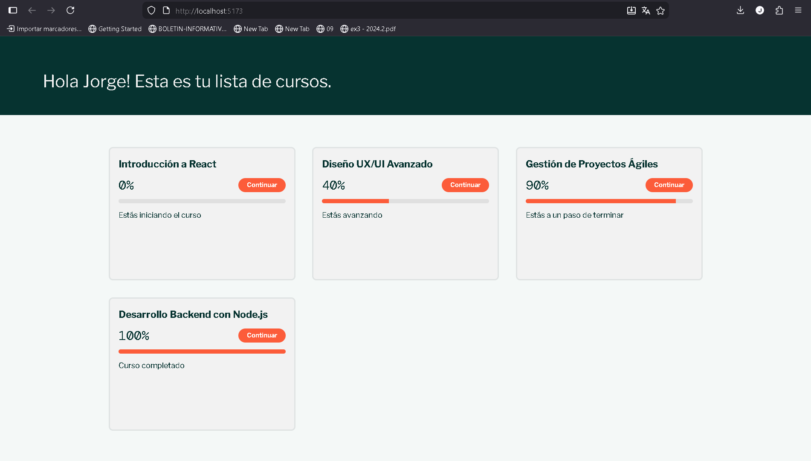

# Course Progress Page




Este proyecto implementa una interfaz visual simple y atractiva para mostrar el progreso de una lista de cursos. Resuelve el problema de visualizar rápidamente cuánto ha avanzado un usuario en sus estudios mediante tarjetas interactivas y claras.

## Componente: `CourseProgress`

El núcleo del proyecto es el componente `CourseProgress`, diseñado para ser reutilizable y autocontenido.

### Props Utilizadas

El componente recibe las siguientes propiedades para renderizar la información dinámica:

*   **`courseName`** (String): El título del curso a mostrar.
*   **`completedLessons`** (Number): La cantidad de lecciones que el usuario ha completado.
*   **`totalLessons`** (Number): El número total de lecciones que tiene el curso.

### Lógica Básica

El componente maneja internamente la lógica de presentación:

1.  **Cálculo de Porcentaje**: Calcula el porcentaje de avance basándose en `(completedLessons / totalLessons) * 100`.
2.  **Límites**: Asegura que el progreso nunca sea menor a 0% ni mayor a 100%.
3.  **Mensajes Condicionales**: Muestra un texto de estado diferente según el avance:
    *   *0%*: "Estás iniciando el curso"
    *   *1-79%*: "Estás avanzando"
    *   *80-99%*: "Estás a un paso de terminar"
    *   *100%*: "Curso completado"
4.  **Estado Visual (Hover)**: Utiliza `useState` para detectar cuando el cursor está sobre la tarjeta (`onMouseEnter`/`onMouseLeave`) y aplicar una transformación de escala (zoom) y sombra para dar retroalimentación interactiva (efecto "pop over").

## Cómo correr el proyecto

Este proyecto utiliza **Vite** con React. Sigue estos pasos para ejecutarlo en tu entorno local:

1.  **Instalar dependencias**:
    Abre una terminal en la carpeta del proyecto y ejecuta:
    ```bash
    npm install
    ```

2.  **Correr el servidor de desarrollo**:
    Una vez instaladas las dependencias, inicia el proyecto con:
    ```bash
    npm run dev
    ```

3.  **Ver en el navegador**:
    La terminal te mostrará una URL local (normalmente `http://localhost:5173/`). Ábrela en tu navegador para ver la aplicación.
